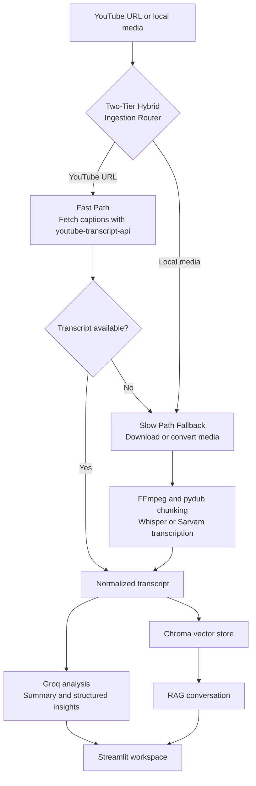

<div align="center">

# VideoSage

### An AI-powered RAG video assistant for clear, searchable knowledge.

A polished AI meeting-intelligence workspace that transcribes video, creates concise summaries, extracts decisions and action items, and lets you chat with the transcript using retrieval-augmented generation.


</div>

---

## Why this project

Important information is often buried inside hour-long meetings, interviews, lectures, podcasts, and research calls. VideoSage turns that unstructured media into a practical workspace: a transcript, an executive summary, decisions, follow-ups, and a grounded question-answering interface.

The project combines local speech recognition, multilingual transcription, LLM-based information extraction, vector search, and a custom Streamlit interface in one end-to-end pipeline.

## What it does

- Accepts a YouTube URL or a local audio/video file path.
- Downloads or converts media and splits long recordings into manageable chunks.
- Transcribes English audio with Groq Whisper and falls back to local Whisper.
- Supports Hinglish translation through Sarvam AI with Groq fallback.
- Generates a professional title and concise meeting summary.
- Extracts action items, key decisions, and unresolved questions.
- Builds a persistent Chroma vector index from the transcript.
- Answers follow-up questions with retrieval-augmented generation.
- Uses Groq for hosted language-model inference.
- Presents the workflow in a responsive, purpose-designed Streamlit UI.

## Product workflow



## Tech stack

| Layer | Technology |
|---|---|
| Interface | Streamlit, custom CSS |
| Media ingestion | youtube-transcript-api, curl-cffi, yt-dlp, FFmpeg, pydub |
| Speech recognition | Groq Whisper, OpenAI Whisper, Sarvam AI |
| LLM orchestration | LangChain, Groq |
| Retrieval | ChromaDB, Hugging Face sentence transformers |
| Language | Python 3.10+ |

## Getting started

### 1. Clone and create an environment

```bash
git clone https://github.com/veerpast/videosage-rag-assistant.git
cd videosage-rag-assistant
python3 -m venv .venv
source .venv/bin/activate
pip install -r requirements.txt
```

FFmpeg must also be installed on your machine. On macOS:

```bash
brew install ffmpeg
```

### 2. Configure credentials

Copy the environment template and add your keys:

```bash
cp .env.example .env
```

| Variable | Required | Purpose |
|---|---:|---|
| `GROQ_API_KEY` | Yes | Groq LLM inference and hosted Whisper transcription |
| `GROQ_LLM_MODEL` | No | Groq chat model; defaults to `llama-3.1-8b-instant` |
| `GROQ_STT_MODEL` | No | Groq transcription model; defaults to `whisper-large-v3-turbo` |
| `GROQ_TRANSLATION_MODEL` | No | Groq audio translation model; defaults to `whisper-large-v3` |
| `SARVAM_API_KEY` | For Hinglish | Speech-to-text translation |
| `WHISPER_MODEL` | No | Local Whisper model; defaults to `small` |

### 3. Run the application

```bash
streamlit run app.py
```

Open `http://localhost:8501`, add a source in the sidebar, select the language, and choose **Analyse video**.

## Project structure

```text
videosage-rag-assistant/
├── app.py                    # Streamlit product interface
├── main.py                   # Command-line pipeline entry point
├── core/
│   ├── transcriber.py        # Whisper and Sarvam transcription
│   ├── summarizer.py         # Map-reduce summaries and title generation
│   ├── extractor.py          # Decisions, questions, and action items
│   ├── vector_store.py       # Chroma indexing and retrieval
│   └── rag_engine.py         # Grounded transcript Q&A
├── utils/
│   └── audio_processor.py    # Downloading, conversion, and chunking
├── requirements.txt
├── packages.txt              # Streamlit Community Cloud system package
└── .streamlit/config.toml
```

## Design decisions

- **One LLM provider:** Groq handles title generation, summarization, structured extraction, and RAG responses in both local and deployed runs.
- **Hybrid ingestion:** YouTube captions take the fast path; unavailable captions and local media use the audio-processing slow path.
- **Chunked processing:** long media is split before transcription and summarization.
- **Grounded answers:** questions retrieve relevant transcript segments before generation.
- **Transcription resilience:** the slow path uses hosted Whisper with local Whisper support for audio transcription.
- **Focused interface:** the UI prioritizes source input, processing state, structured results, and conversation without unnecessary dashboard clutter.

## Deployment

The repository is prepared for Streamlit Community Cloud:

1. Push the project to GitHub.
2. In Streamlit Community Cloud, create an app from the repository.
3. Set the entry point to `app.py`.
4. Add `GROQ_API_KEY` and, if needed for Hinglish audio, `SARVAM_API_KEY` in **App settings → Secrets**.
5. Deploy.

> Whisper and sentence-transformer models are resource-intensive. For production traffic, moving transcription and vector indexing to background workers or managed services is recommended.

## Roadmap

- Direct drag-and-drop uploads.
- Speaker diarization and timestamped transcript navigation.
- Export to Markdown and PDF.
- Saved workspaces and analysis history.
- Streaming pipeline progress and partial results.

## Author

Built as an end-to-end applied AI project demonstrating media processing, LLM orchestration, retrieval-augmented generation, and product-focused interface design.

---

<div align="center">
If this project is useful, consider giving it a star.
</div>
