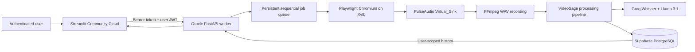

<div align="center">

# VideoSage

### An AI-powered RAG video assistant for clear, searchable knowledge.

A production-oriented meeting-intelligence platform that can process uploaded media or autonomously attend Google Meet sessions, then generate searchable transcripts, summaries, decisions, and action items.

**Live frontend:** [airag-video-meeting.streamlit.app](https://airag-video-meeting.streamlit.app/)


</div>

---

## Why this project

Important information is often buried inside hour-long meetings, interviews, lectures, podcasts, and research calls. VideoSage turns that unstructured media into a practical workspace: a transcript, an executive summary, decisions, follow-ups, and a grounded question-answering interface.

The project combines browser automation, virtual audio capture, multilingual transcription, LLM-based information extraction, private vector search, and a Streamlit frontend across a two-service architecture.

## What it does

- Accepts a YouTube URL or a drag-and-drop audio/video upload.
- Sends an autonomous browser bot to a Google Meet URL through an authenticated webhook.
- Stores private meeting history in Supabase with email/password authentication and PostgreSQL RLS.
- Downloads or converts media and splits long recordings into manageable chunks.
- Transcribes English audio and translates Hinglish with Groq Whisper.
- Generates a professional title and concise meeting summary.
- Extracts action items, key decisions, and unresolved questions.
- Builds an isolated in-memory Chroma index for each active RAG workspace.
- Answers follow-up questions with retrieval-augmented generation.
- Uses Groq for hosted language-model inference.
- Presents the workflow in a responsive, purpose-designed Streamlit UI.

## System architecture



The frontend and worker are separate services. Streamlit never receives the
Supabase service-role key and cannot start a browser locally. The Oracle worker
verifies both the private service token and the signed-in user's Supabase JWT.
It runs one browser at a time so simultaneous meetings cannot mix audio on the
shared PulseAudio monitor.

## Media ingestion workflow


## Tech stack

| Layer | Technology |
|---|---|
| Frontend | Streamlit Community Cloud, custom CSS |
| Authentication | Supabase Auth, JWT, PostgreSQL RLS |
| Worker API | FastAPI, Uvicorn, authenticated webhooks |
| Browser automation | Playwright Chromium, Xvfb |
| Virtual audio | PulseAudio `Virtual_Sink`, FFmpeg |
| Media ingestion | youtube-transcript-api, curl-cffi, yt-dlp, FFmpeg, pydub |
| Speech recognition | Groq Whisper transcription and translation |
| LLM orchestration | LangChain, Groq |
| Retrieval | ChromaDB, ONNX `all-MiniLM-L6-v2` embeddings |
| Persistence | Supabase PostgreSQL |
| Infrastructure | Oracle Cloud Always Free (E2 Micro; A1-ready), Caddy, systemd |
| Language | Python 3.10+ |

## Getting started

### 1. Clone and create an environment

```bash
git clone https://github.com/veerpast/videosage-rag-assistant.git
cd videosage-rag-assistant
python3 -m venv .venv
source .venv/bin/activate
pip install -r requirements.txt
```

The application uses Groq for both transcription and Hinglish-to-English
translation, keeping the frontend and worker free of heavyweight local models.

FFmpeg must also be installed on your machine. On macOS:

```bash
brew install ffmpeg
```

### 2. Configure credentials

Copy the environment template and add your keys:

```bash
cp .env.example .env
```

| Variable | Required | Purpose |
|---|---:|---|
| `GROQ_API_KEY` | Yes | Groq LLM inference and hosted Whisper transcription |
| `GROQ_LLM_MODEL` | No | Groq chat model; defaults to `llama-3.1-8b-instant` |
| `GROQ_STT_MODEL` | No | Groq transcription model; defaults to `whisper-large-v3-turbo` |
| `GROQ_TRANSLATION_MODEL` | No | Groq audio translation model; defaults to `whisper-large-v3` |
| `SUPABASE_URL` | Yes | Supabase project URL used by authentication |
| `SUPABASE_ANON_KEY` | Yes | Public Supabase key used for sign-in and sign-up |
| `WORKER_API_URL` | For Meet bot | HTTPS URL of the Oracle worker |
| `WORKER_API_TOKEN` | For Meet bot | Shared Streamlit-to-worker secret |

### 3. Run the application

```bash
streamlit run app.py
```

Open `http://localhost:8501`, add a source in the sidebar, select the language, and choose **Analyse video**.

## Project structure

```text
videosage-rag-assistant/
├── app.py                    # Streamlit product interface
├── main.py                   # Command-line pipeline entry point
├── services/
│   ├── auth_client.py        # Supabase email/password authentication
│   └── worker_client.py      # Authenticated Oracle webhook client
├── worker/
│   ├── api.py                # FastAPI queue and worker endpoints
│   ├── meet_bot.py           # Playwright Google Meet attendee
│   ├── audio_capture.py      # PulseAudio and FFmpeg recording
│   └── supabase_store.py     # User-scoped meeting persistence
├── core/
│   ├── transcriber.py        # Groq Whisper transcription and translation
│   ├── summarizer.py         # Map-reduce summaries and title generation
│   ├── extractor.py          # Decisions, questions, and action items
│   ├── vector_store.py       # Chroma indexing and retrieval
│   └── rag_engine.py         # Grounded transcript Q&A
├── utils/
│   └── audio_processor.py    # Downloading, conversion, and chunking
├── supabase/migrations/      # PostgreSQL schema, indexes, and RLS
├── deploy/oracle/            # Xvfb/PulseAudio/Caddy/systemd provisioning
├── docs/ORACLE_DEPLOYMENT.md # Complete free-tier deployment runbook
├── requirements.txt
├── requirements-worker.txt  # Oracle-only service dependencies
├── packages.txt              # Streamlit Community Cloud system package
└── .streamlit/config.toml
```

## Design decisions

- **One LLM provider:** Groq handles title generation, summarization, structured extraction, and RAG responses in both local and deployed runs.
- **Microservice isolation:** Streamlit handles interaction while Oracle owns long-running browser and audio workloads.
- **Private multi-tenant history:** Supabase Auth identifies users and RLS limits every account to its own meetings.
- **Two-layer worker security:** a service webhook token protects the Oracle API and a user JWT assigns each job to its owner.
- **Consent enforcement:** the UI and worker API both require recording-consent confirmation, which is timestamped in PostgreSQL.
- **Restart-safe queue:** queued and interrupted jobs are recovered from PostgreSQL when the worker restarts.
- **Free-tier egress control:** history queries omit transcripts; full text is fetched only when a user requests it.
- **Database-enforced usage limits:** atomic PostgreSQL functions cap daily analyses and RAG questions so browser refreshes cannot bypass free-tier protection.
- **Hybrid ingestion:** YouTube captions take the fast path; unavailable captions and local media use the audio-processing slow path.
- **Chunked processing:** long media is split before transcription and summarization.
- **Grounded answers:** questions retrieve relevant transcript segments before generation.
- **Lean cloud runtime:** Chroma's CPU ONNX MiniLM path avoids multi-gigabyte PyTorch/CUDA installs on Streamlit Community Cloud.
- **Lean transcription:** the slow path uses hosted Groq Whisper so neither cloud service loads a local speech model.
- **Focused interface:** the UI prioritizes source input, processing state, structured results, and conversation without unnecessary dashboard clutter.

## Deployment

The Streamlit frontend, Supabase backend, and autonomous Oracle worker are
deployed. The worker is available through Caddy-managed HTTPS at
`https://140-245-235-136.sslip.io`; its meeting endpoints require both the
private service token and the signed-in user's Supabase JWT.

1. Deploy the repository's `app.py` on Streamlit Community Cloud.
2. Add `GROQ_API_KEY`, `SUPABASE_URL`, and `SUPABASE_ANON_KEY` in **App settings → Secrets**.
3. Apply `supabase/migrations/001_meeting_runs.sql` to a Supabase Free project.
4. Deploy the Oracle worker using `docs/ORACLE_DEPLOYMENT.md`.
5. Add `WORKER_API_URL` and `WORKER_API_TOKEN` to Streamlit Secrets.

The complete Oracle VM, Supabase migration, HTTPS, systemd, and Streamlit
configuration procedure is in [the Oracle deployment runbook](docs/ORACLE_DEPLOYMENT.md).
The service-by-service quota and no-overage strategy is documented in the
[zero-cost operating model](docs/ZERO_COST_ARCHITECTURE.md).

This architecture uses [Streamlit Community Cloud](https://docs.streamlit.io/deploy/streamlit-community-cloud), an [Oracle Always Free compute shape](https://docs.oracle.com/en-us/iaas/Content/FreeTier/freetier.htm), and [Supabase Free](https://supabase.com/pricing). The deployed worker uses E2 Micro because Ampere A1 capacity was unavailable in Hyderabad; it is configured for one meeting at a time with swap-backed memory. Free tiers have resource limits and no production uptime SLA.

## Current deployment status

- Streamlit frontend: deployed.
- Supabase Auth, PostgreSQL schema, RLS, history, and quotas: deployed.
- YouTube and upload analysis: available after sign-in.
- Oracle Google Meet worker: live on an Always Free E2 Micro VM in Hyderabad with Caddy HTTPS, systemd restart recovery, a 4 GB swap safety net, fail2ban, unattended security updates, and authenticated webhook access.

## Roadmap

- Speaker diarization and timestamped transcript navigation.
- Streaming pipeline progress and partial results.
- Speaker-aware transcripts for autonomous meetings.

## Author

Built as an end-to-end applied AI project demonstrating media processing, LLM orchestration, retrieval-augmented generation, and product-focused interface design.

---

<div align="center">
If this project is useful, consider giving it a star.
</div>
