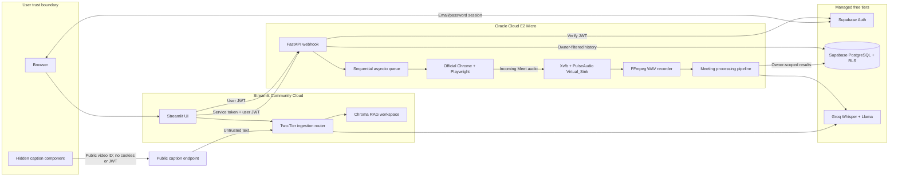
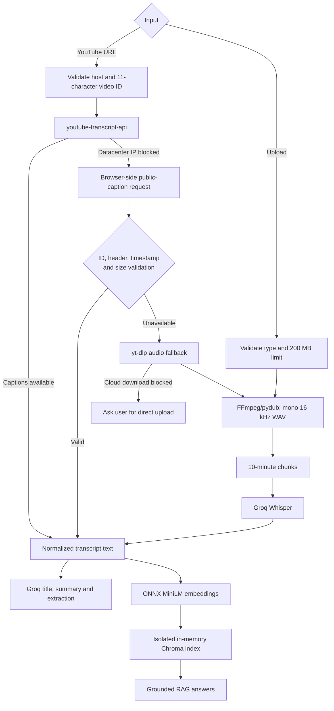
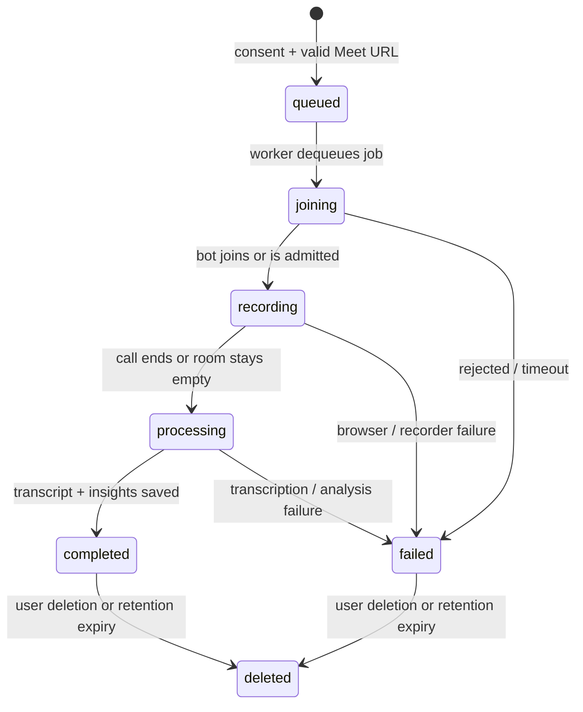

# VideoSage System Design

This is the implementation-level architecture for the public deployment. It
describes what is running now, including free-tier limits and trust boundaries;
it is not a hypothetical scale diagram.

## System context

The service-role key exists only on Oracle. Streamlit receives the public
Supabase anon key, while every worker request requires both a private
Streamlit-to-worker token and the current user's JWT.

## Existing-video ingestion

The fast path returns text and deliberately skips Whisper. The slow path returns
audio chunk paths. That explicit type boundary prevents captioned videos from
paying the latency and token cost of speech recognition.

## Autonomous meeting lifecycle

One browser records at a time because all Chrome sessions share one PulseAudio
monitor. Queued or interrupted database jobs are recovered after a worker
restart. The Meet URL is removed when processing finishes; raw audio is deleted
in a `finally` cleanup path.

## Security and data lifecycle

| Boundary | Control |
|---|---|
| Public app → account | Supabase email/password auth and expiring JWTs |
| Streamlit → worker | HTTPS, private bearer token, user JWT |
| User → meeting row | `user_id` ownership checks and PostgreSQL RLS |
| Meet submission | Google Meet host validation plus consent required in UI and API |
| Browser caption payload | Exact video-ID match, expected header/timestamps, 5 MB ceiling |
| Stored results | User-selectable 1/7/30-day expiry and immediate permanent deletion |
| Raw recording | Temporary worker file; deleted after success or failure |
| Secrets | `.env`/Streamlit secrets/systemd environment; excluded from Git |

The operator can access infrastructure and the Supabase service role for
maintenance, so the system does not claim zero-knowledge or end-to-end encrypted
storage. Normal users can see only their own meetings.

## Verified free-tier capacity

| Resource | Enforced operating envelope |
|---|---|
| Oracle worker | E2 Micro, 1 OCPU, 1 GB RAM plus 4 GB swap |
| Concurrent live meetings | 1 recording; additional jobs wait in the sequential queue |
| Maximum meeting duration | 6 hours by default |
| Meetings per account | 3 in a rolling 24-hour window |
| Existing-video analyses | 5 per account per UTC day |
| RAG questions | 20 per account per UTC day |
| Upload size | 200 MB |
| Result retention | 1, 7, or 30 days |

These caps protect a public portfolio deployment from accidental free-tier
overage. They are capacity controls, not claims of enterprise availability.
